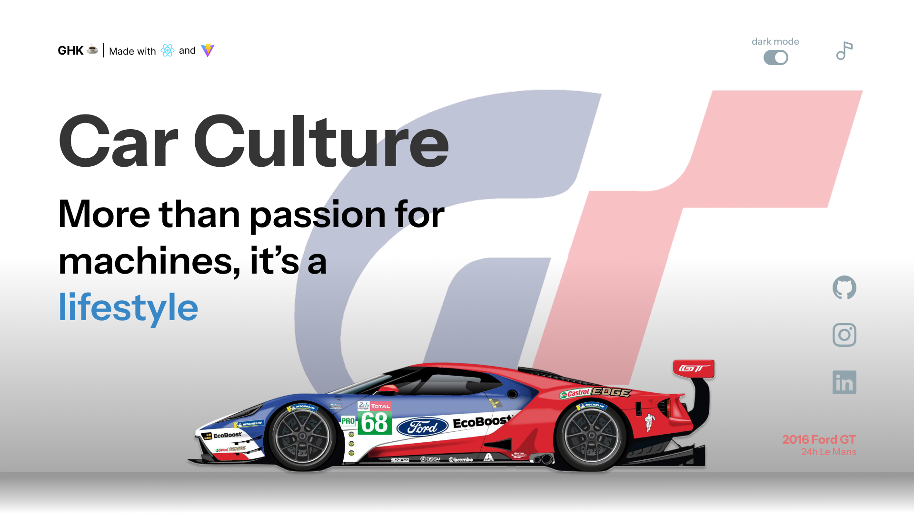
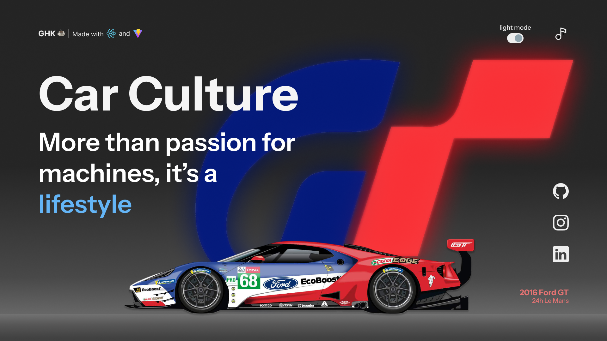
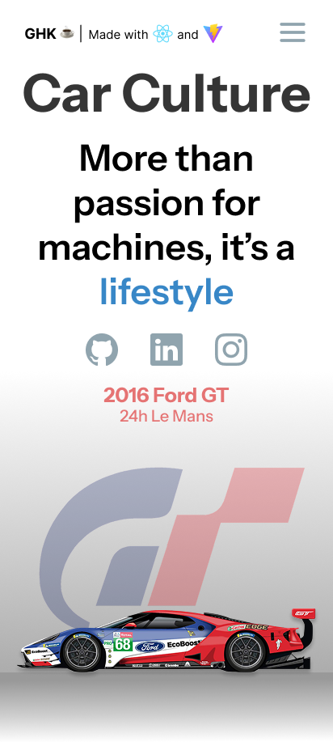
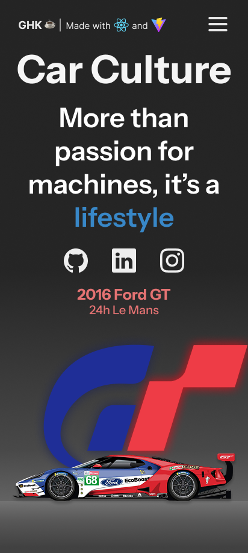

# Car Culture

[](https://opensource.org/licenses/MIT)

Um projeto desenvolvido utilizando a stack **Vite** + **React** + **TailwindCSS** com o objetivo de demonstrar a minha paixão por carros e homenagear um dos meus jogos favoritos, **Gran Turismo 4**. O site possui suporte ao modo claro e escuro com persistência, componentes reutilizzáveis e design responsivo.

Um pequeno easter egg, a minha inspiração para o desenvolvimento da página, também está presente no projeto. 🎶

## Stack empregada no projeto

      

## Design no Figma


> Landing Page (light mode)

---

> Landing Page (dark mode)

---

> Landing Page no mobile (light mode)

---

> Landing Page no mobile (dark mode)

---

## Como rodar localmente

1. Clonar o repositório:

```bash
git clone https://github.com/gustavo-h-k-oliveira/car-culture.git
cd car-culture
```

2. Instalar dependências:

```bash
npm install
```

3. Iniciar servidor de desenvolvimento:

```bash
npm run dev
```

Abra no navegador: `http://localhost:5173` (padrão do Vite).

## Deploy no GitHub Pages

Este projeto está configurado para deploy automático no GitHub Pages. Sempre que houver um push para a branch `main`, o GitHub Actions irá automaticamente:

1. Fazer o build do projeto
2. Publicar o site no GitHub Pages

Para habilitar o GitHub Pages no seu fork:

1. Vá em **Settings** > **Pages** no repositório
2. Em **Source**, selecione **GitHub Actions**

O site estará disponível em: `https://[seu-usuario].github.io/car-culture/`

## Contribuição

Sinta‑se à vontade para contribuir. Forks e Pull Requests são bem‑vindos!
